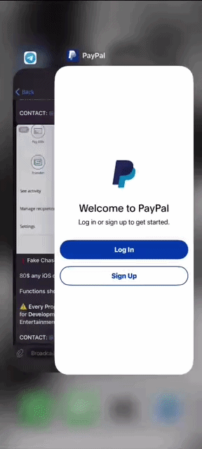

# 💳 PayPal Prank App for iOS

A Swift-based iOS prank and demo application that simulates a fictional payment experience for entertainment and demonstration purposes.

> [!WARNING]
> **Unofficial prank/demo application.** This project is **not affiliated with, endorsed by, or connected to PayPal**. It does **not** process real payments or connect to real PayPal accounts.

---

## 📱 About

This project is an **iOS-only** application built with Swift.

It provides a simulated payment interface designed for **entertainment, demonstrations, and harmless pranks**.

### ✨ Features

* 📱 iOS-only
* 🧑‍💻 Built with Swift
* 💳 Simulated payment interface
* 🎭 Designed for pranks and demonstrations
* 🚫 No real payment processing
* 🔒 No connection to real PayPal accounts
* 📦 Precompiled iOS release available

---

## 🎥 Demo

An example video is included in the repository:

****

> If GitHub does not preview the video directly, download `paypal.mp4` from the repository and open it locally.

---

## 📥 Download

A compiled version of the application is available for download:

**[⬇️ Download the Latest Release](https://github.com/reversionet/paypal-clone-app-ios/releases/download/v1/Paypal.ipa)**

The release contains the compiled iOS application intended for sideloading onto a compatible device.

---

## ⚙️ Requirements

To use the compiled application, you will need:

* 📱 An iOS device
* 🔧 A method for sideloading the provided `.ipa` file

No source-code setup or development environment is required when using the precompiled release.

---

## 🍎 Platform Support

This project is made for **iOS only**.

| Platform   | Support |
| ---------- | :-----: |
| 🍎 iOS     |  ✅ Yes  |
| 🤖 Android |   ❌ No  |
| 🪟 Windows |   ❌ No  |
| 💻 macOS   |   ❌ No  |

---

## 📲 Sideloading

Download the latest compiled release and sideload it onto a compatible iOS device using your preferred sideloading method.

The precompiled release does **not** require Xcode or Swift to use.

> **Note:** You are responsible for ensuring that your chosen sideloading method and the application comply with applicable platform rules and laws.

---

## ⚠️ Disclaimer

This project is intended for **entertainment, experimentation, and demonstration purposes only**.

This application:

* 🚫 Does not process real payments
* 🚫 Does not connect to PayPal
* 🚫 Does not access PayPal accounts
* 🚫 Does not handle real financial transactions
* 🚫 Is not an official PayPal application
* 🚫 Is not affiliated with PayPal

**Do not use the application to falsely represent a real financial transaction, deceive someone about an actual payment, or conduct fraudulent activity.**

---

## 👤 Credits

Created by the original project author.

Please retain the original credits when redistributing or modifying the project.

---

## 📢 Telegram

For updates, announcements, and other projects, join the Telegram channel:

**[📣 Join the Telegram Channel](https://t.me/undecryptable81)**

---

## ⭐ Support the Project

If you find the project useful or interesting, consider giving the repository a star!

⭐ **A star helps support the project and makes it easier for others to discover.**

---

## 📄 License

See the repository for applicable licensing information.

If no license file is provided, the source code remains under the copyright of its respective author and is **not automatically licensed for redistribution or modification**.
